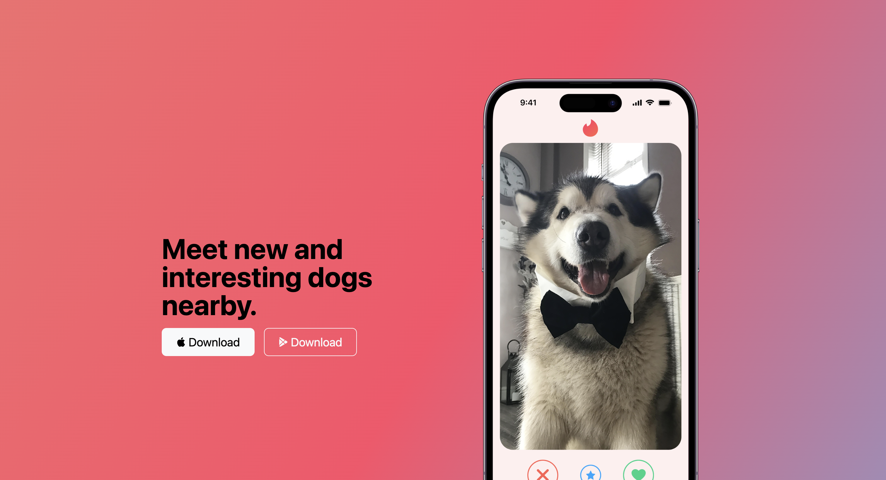
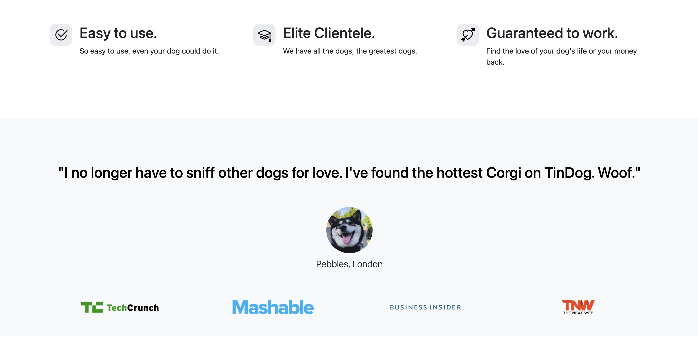
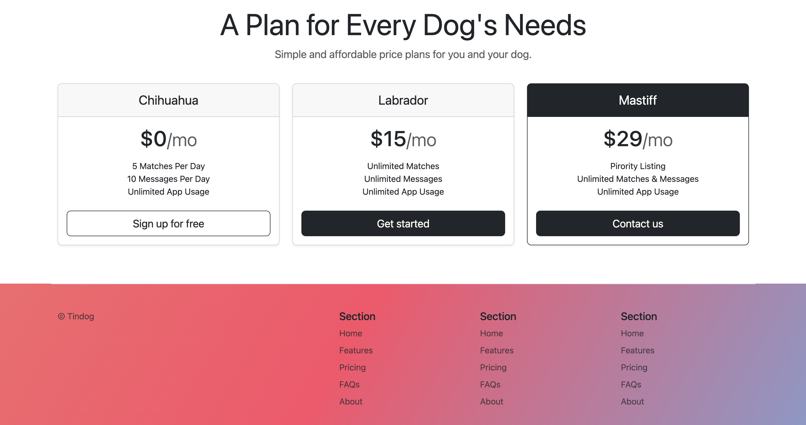

## TinDog

TinDog is a fun, creative project that mimics a dating app but with a twist: it's exclusively for dogs. The idea is to provide a platform where dog owners can find friends or potential partners for their furry companions.

### Features

- **Landing Page**: A captivating landing page that introduces users to the world of TinDog.
- **About**: Information on what TinDog offers to its users and their canine friends.
- **Testimonials**: Happy stories and feedback from our satisfied canine users and their humans.
- **Pricing Plans**: Various subscription options tailored to different needs and budgets.
- **Contact**: A section for users to get in touch with the TinDog team for any queries or support.

### Technologies Used

- Bootstrap 4
- CSS3
- HTML5

### Screenshot

